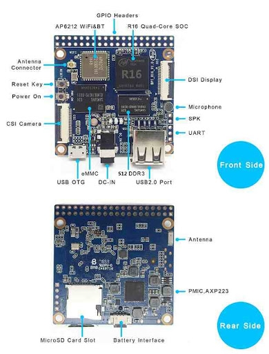
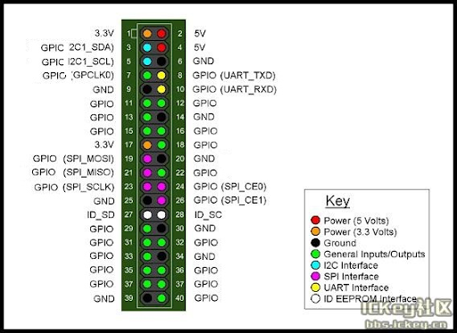

# Banana PI BPI-M2 Magic (BPi-M2M) Expansions 
| 

Kali Linux 2020.x Banana PI BPI-M2 Magic (BPi-M2M) Expansions 

     git BPI-M2-Magic

sudo rm -rf BPI-M2-Magic
sudo git clone https://github.com/D3vD3m0n/BPI-M2-Magic.git
sudo chmod -R 755 BPI-M2-Magic
cd BPI-M2-Magic/
configure:
sudo ./configure
sudo make
sudo make install

     Install BPI-M2-Magic via curl Install BPI-M2-Magic via wget 

$ sh -c "$(curl -fsSL https://raw.github.com/D3vD3m0n/BPI-M2-Magic/master/tools/install.sh)"

# BPI-M2 Magic hardware

Banana Pi BPI-M2 Magic can use A33 and R16 chip on board, and Allwinner A33 and R16 chip is PIN to PIN cmpatibility other spec is same.
+ 1 BPI-M2 Magic :Allwinner A33 onboard ,without eMMC flash onboard .
+ 2 BPI-M2 Magic Plus: Allwinner R16 onboard with 8G eMMC flash onboard.

<h1 class="reset-3c756112--pageTitle-33dc39a3">BPI-M2 Magic hardware spec</h1>

<table class="table-0f56c2d8" data-key="6dba3133d3d843cdbd72c9d32b179ebf"><tbody><tr class="tableRow-41a0302b" data-key="a373b43df3f646188ed782721b75a5ab"><td data-table="cell" class="tableCell-150ac604" style="text-align: left;" data-key="385ca7825e1f4510bc165bba30c6bba2">
Soc
</td><td data-table="cell" class="tableCell-150ac604" style="text-align: left;" data-key="e66d9f2573e648d597edc8fb33282eb5">
Allwinner R16,Quad-code ARM Cortex-A7，also support A33 design
</td></tr><tr class="tableRow-41a0302b" data-key="f0d6e64ddd7f435787aef0a464d76e39"><td data-table="cell" class="tableCell-150ac604" style="text-align: left;" data-key="f903e0d1b0f447d28d79adb98081f1b8">
GPU
</td><td data-table="cell" class="tableCell-150ac604" style="text-align: left;" data-key="c02f6a410e5f40af98a1a4741ecf02a1">
Mali 400 MP2
</td></tr><tr class="tableRow-41a0302b" data-key="8d3f11cdf1884b2e8dbef759377f2905"><td data-table="cell" class="tableCell-150ac604" style="text-align: left;" data-key="55f82448908f496dade51a91e4be689c">
SDRAM
</td><td data-table="cell" class="tableCell-150ac604" style="text-align: left;" data-key="aa7cf8c66b4f41f0b0f80e884820b281">
512MB DDR3 (shared with GPU)
</td></tr><tr class="tableRow-41a0302b" data-key="ac6435d3a7b845d0a26bf47f3a330b37"><td data-table="cell" class="tableCell-150ac604" style="text-align: left;" data-key="92cbc775a7ab4cf2bbb95cc4a54bf2c1">
Power
</td><td data-table="cell" class="tableCell-150ac604" style="text-align: left;" data-key="b960f722164a4f44bc08bc90d50489c5">
5V @ 2A via DC power
</td></tr><tr class="tableRow-41a0302b" data-key="3e32c34857ea40e5b4dc6527e021f8a2"><td data-table="cell" class="tableCell-150ac604" style="text-align: left;" data-key="4877771eab054e1fa9e9206d43d6ecc5">
Low-level peripherals
</td><td data-table="cell" class="tableCell-150ac604" style="text-align: left;" data-key="2ec977be02c047779f5b772215ce3579">
40 Pins Header, 28×GPIO, some of which can be used for specific functions including UART, I2C, SPI, PWM.
</td></tr><tr class="tableRow-41a0302b" data-key="a07950a1c60d47fe9327a05f5c971116"><td data-table="cell" class="tableCell-150ac604" style="text-align: left;" data-key="7d0828c7a9ba4d49a81dfb718c9a6d00">
Wifi
</td><td data-table="cell" class="tableCell-150ac604" style="text-align: left;" data-key="8759c436a4994737b33502019abf830d">
Wifi 802.11 b/g/n 2.4GHz (AP6212)
</td></tr><tr class="tableRow-41a0302b" data-key="239a6aea378043aab5e64c2906118b6d"><td data-table="cell" class="tableCell-150ac604" style="text-align: left;" data-key="6445d71ade444661828a8c848c7cfb19">
Bluetooth
</td><td data-table="cell" class="tableCell-150ac604" style="text-align: left;" data-key="7937801fb27842d0b9d4c9112dae48ef">
BT4.0 BLE
</td></tr><tr class="tableRow-41a0302b" data-key="b208d052c4694fcd8a279a3448f2af5a"><td data-table="cell" class="tableCell-150ac604" style="text-align: left;" data-key="033aa95f28e44a4384021540e0a54c9d">
On board Storage
</td><td data-table="cell" class="tableCell-150ac604" style="text-align: left;" data-key="1f477bfb72b1474492ebe1b177d0abde">
MicroSD (TF) card, eMMC 8G on board (option：16/32/64G)
</td></tr><tr class="tableRow-41a0302b" data-key="ed341a539929429aa90a7325a0b68a6a"><td data-table="cell" class="tableCell-150ac604" style="text-align: left;" data-key="daab4716400c4b7787b7bfa06060217e">
Display
</td><td data-table="cell" class="tableCell-150ac604" style="text-align: left;" data-key="3ce3f2dbb946472192aab55258e2d0d2">
MIPI Display Serial Interface (DSI) interface(4 data lanes)
</td></tr><tr class="tableRow-41a0302b" data-key="4de1404e037c413a9526f17a929cb6f1"><td data-table="cell" class="tableCell-150ac604" style="text-align: left;" data-key="2079b8f7fb96494f8722095e21addf77">
Camera
</td><td data-table="cell" class="tableCell-150ac604" style="text-align: left;" data-key="c77c2ab554064a7c85e166ecc8272694">
A CSI input connector Camera:Supports 8-bit YUV422 CMOS sensor interface,Supports CCIR656 protocol for NTSC and PAL,Supports 5M pixel camera sensor ,Supports video capture solution up to 1080p@30fps
</td></tr><tr class="tableRow-41a0302b" data-key="c1472da42fdb460a9af8125c12282a8c"><td data-table="cell" class="tableCell-150ac604" style="text-align: left;" data-key="186515f3db494e0389017706524dcfee">
Video decoder
</td><td data-table="cell" class="tableCell-150ac604" style="text-align: left;" data-key="7af9983bd37244b7979566b8fbda9ca4">
Multi-format FHD video decoding, including Mpeg1/2, Mpeg4, H.263, H.264, etc H.264 high profile 1080p@60fps
</td></tr><tr class="tableRow-41a0302b" data-key="4301ed7d7dd34cceab76d0069d24393f"><td data-table="cell" class="tableCell-150ac604" style="text-align: left;" data-key="a2c208924e934e6883b5dbb226d57bba">
Video encoder
</td><td data-table="cell" class="tableCell-150ac604" style="text-align: left;" data-key="02b08b1f11634a3eaad4dc0b2b37dd29">
H.264 encoder: high profile 1080p@60fps
</td></tr><tr class="tableRow-41a0302b" data-key="7be0c6bd8a354384b52853fa866f4c14"><td data-table="cell" class="tableCell-150ac604" style="text-align: left;" data-key="c9a3257d76d74ce69a659ef7d95e465b">
Audio input
</td><td data-table="cell" class="tableCell-150ac604" style="text-align: left;" data-key="c33705fe568a4adf89836d18e9c95355">
On board microphone
</td></tr><tr class="tableRow-41a0302b" data-key="00d57960b49a4c28819b8e92a47cf388"><td data-table="cell" class="tableCell-150ac604" style="text-align: left;" data-key="ed9263f14fb44c469ac575b50c9bafba">
USB
</td><td data-table="cell" class="tableCell-150ac604" style="text-align: left;" data-key="48b332ab8b1a4e31aae522e6692506af">
1x USB 2.0 host,  1x USB 2.0 OTG
</td></tr><tr class="tableRow-41a0302b" data-key="6cfcd83533404c908fa876bc2ccf8af4"><td data-table="cell" class="tableCell-150ac604" style="text-align: left;" data-key="f8ed9253453b4b2e8d1f73b93d916b56">
Buttons
</td><td data-table="cell" class="tableCell-150ac604" style="text-align: left;" data-key="58cd36111ca8420c9c7756c8a6904930">
Reset button, Power button
</td></tr><tr class="tableRow-41a0302b" data-key="e100905b433d4b70b82ebf03f4c253de"><td data-table="cell" class="tableCell-150ac604" style="text-align: left;" data-key="9dfc64586c724e1c895477bb014d6888">
Leds
</td><td data-table="cell" class="tableCell-150ac604" style="text-align: left;" data-key="173771c5d0424d9484bceedaf78ee769">
Red, Green, Blue
</td></tr><tr class="tableRow-41a0302b" data-key="6bc2f5503faf4c6e864cc66fdfb9b829"><td data-table="cell" class="tableCell-150ac604" style="text-align: left;" data-key="9e2abf15d81648a5a49e2ebee8230e53">
battery
</td><td data-table="cell" class="tableCell-150ac604" style="text-align: left;" data-key="057f86ad5ef049419794694551ee5b3f">
3.7V lithium battery power support
</td></tr><tr class="tableRow-41a0302b" data-key="524cbc7f51ed44548c885523ec5bc5e8"><td data-table="cell" class="tableCell-150ac604" style="text-align: left;" data-key="3641db08f5ce4bf4b771d7733366320f">
Sizes
</td><td data-table="cell" class="tableCell-150ac604" style="text-align: left;" data-key="756e181e27fa473885996d5ca5d1a1ef">
51 mm × 51mm
</td></tr><tr class="tableRow-41a0302b" data-key="12417a3d43b14709838d3fde1acb9a07"><td data-table="cell" class="tableCell-150ac604" style="text-align: left;" data-key="1765df3d19bb44f8aac3411c8eb0c01a">
Weight
</td><td data-table="cell" class="tableCell-150ac604" style="text-align: left;" data-key="93d950fb8a86452482d3d00d601e2a30">
40g
</td></tr></tbody></table>

|
______________________________________________________
| 
